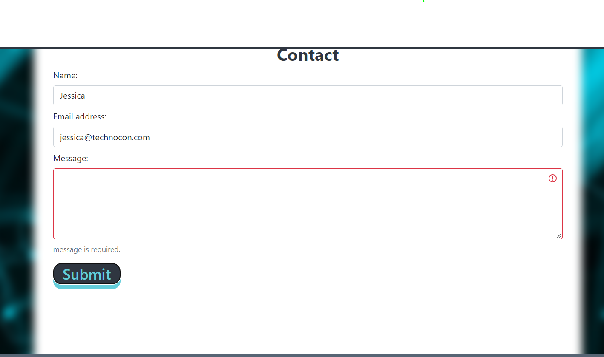

# Krupali's Portfolio

## Table of Contents

- [Goal](#goal)
- [Deployment](#deployment)
- [Details](#details)
- [Technologies Used](#technologies-used)
- [Contributor](#contributor)

## Goal

Create my own portfolio, using your new React skills. This is a place to share my projects not only for applying jobs or working as a freelancer but also to share my work with fellow developers and collaborate on future projects.

## Deployment

Please check live site of my portfolio is here:

https://rpkrupali1.github.io/krupali_portfolio/

## Details

When you launch to the site you will see navbar with menu options as below:

- About Me
- Portfolio
- Contact
- Resume

In `About Me` section, you will see all information about me with profile pics

In `Portfolio` section you will see list of all projects that I have contributed/developed.  Clicking on git icon will take you to git link and clicking on project link to will take you to live site of that project.

In `Contact` section you can submit contact form. Contact forms has validation added for missing information or for incorrect email format, you will get message accordingly and also a red border for field that failed validation:

In `Resume section` you will see my technical skiils along with an option to download resume.

## Technologies Used

- This project was bootstrapped with React
- HTML
- CSS
- JSX (JavaScript XML)

### Available Scripts

In the project directory, you can run:

`npm start`

Runs the app in the development mode.\
Open [http://localhost:3000](http://localhost:3000) to view it in your browser.

The page will reload when you make changes.\
You may also see any lint errors in the console.

## Contributor

This app is created by Krupali
